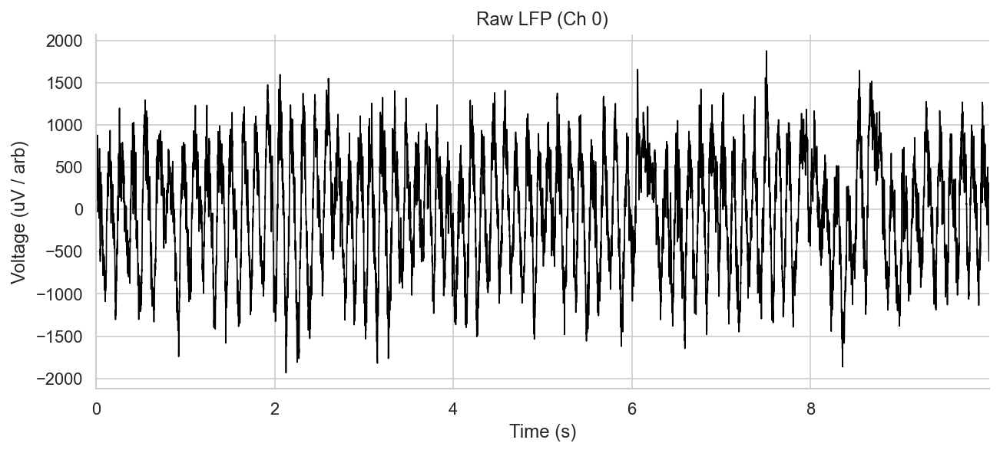
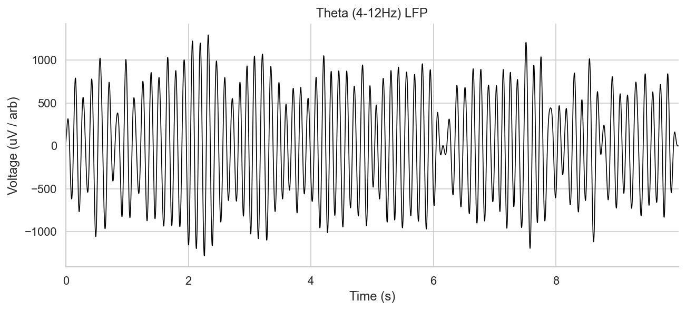
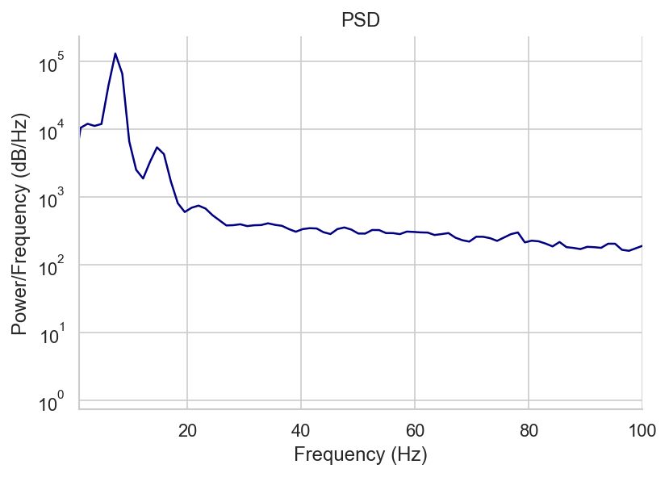
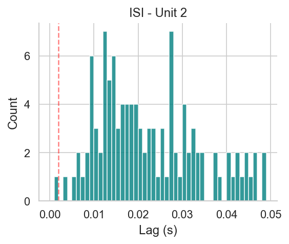
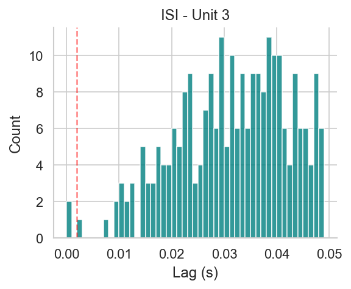
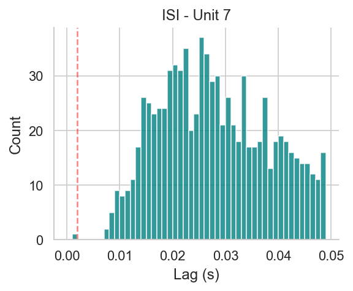
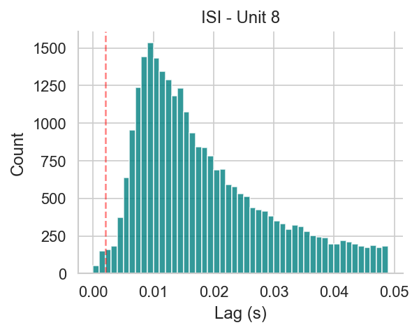
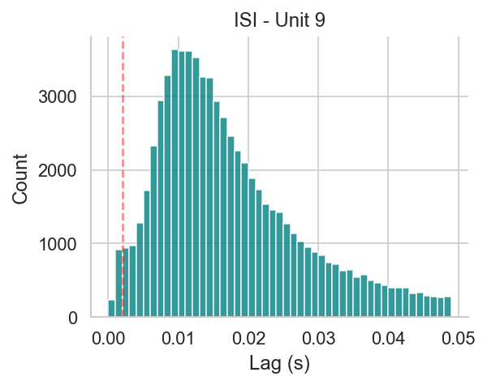

# Session Report: ec013.423
    
## General Info
- **Channels**: 65
- **Sampling Rate**: 20000.0 Hz
- **LFP Sampling Rate**: 1250.0 Hz

## LFP Analysis

## Spike Sorting Summary
Found 77 units (cluster > 1).

### First 5 Units
|    | Unit             |   Cluster |   Shank |   N_Spikes |    ISI_Viol |
|---:|:-----------------|----------:|--------:|-----------:|------------:|
|  0 | ec013.423_sh1_c2 |         2 |       1 |        509 | 0.0019685   |
|  1 | ec013.423_sh1_c3 |         3 |       1 |       2416 | 0.000828157 |
|  2 | ec013.423_sh1_c7 |         7 |       1 |       3646 | 0.000274348 |
|  3 | ec013.423_sh1_c8 |         8 |       1 |      39698 | 0.00511374  |
|  4 | ec013.423_sh1_c9 |         9 |       1 |      80064 | 0.0143387   |

### Example ISIs

